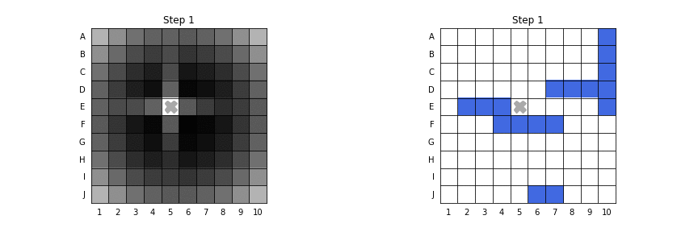

# battleship-simulator

Battleship game simulator based on [DataGenetics' battleship analysis.](http://www.datagenetics.com/blog/december32011/) There are multiple Jupyter Notebooks which implement different game strategies and their statistical analysis. The GIF below shows the implementation of the most efficient strategy. Left side shows the probability distribution, while the right side shows the actual game.

## Notebooks
- **gameboard.ipynb** - This notebooks shows the process of implementing the Gameboard class. This class is responsible for simulating the actual game, such as generating the ship positions on a board and showing the graphics of intermediate steps.
- **random-strategy.ipynb** - The first possible strategy implemented. It is to make shots totally at random. It implements Random strategy class, calculates number of shots and accuracy distribution.
- **hunt-and-target-strategy.ipynb** - This strategy greatly improves the result. Initially, shots can be fired at random, but once part of a ship has been hit, it's possible to search up, down, left and right looking for more of the same ship. This notebook also calculates shot and accuracy distributions.
- **hat-with-parity-strategy.ipynb** - This strategy makes a slight improvement to the Hunt part of the hunt and target algorithm using parity. Because the minimum length of a ship is two units long, we don't need to random search every location on the board. Even the shortest ship has to span two adjacent squares.
- **final-strategy** - This is the most effiecient strategy that can be implemented when playing a fair battleship game. It calculates the probability distribution of ship cells on the board. Then the most probable cell is chosen to be shot at.

## Python Classes
- **Gameboard.py** - The Gameboard class represents a game board for a Battleship game. It provides methods to hide and unhide boats, simulate shooting, track game statistics, and generate a visual representation of the board.
- **Random.py** - This class generates random locations for ships in a game. It maintains lists of possible and available locations on the game board. It provides methods for generating random locations for ships of various lengths, and ensures these generated locations are legal.

## Learn More
If you want to learn more about these strategies without delving deep into the code, you can watch the [Vsauce2 video](https://www.youtube.com/watch?v=LbALFZoRrw8) that discusses these strategies. The video is based on the same article that inspired my implementation.
